#dujs
##Def-Use tool for JavaScript
(working project)

Aim to find the intra-procedural, inter-procedural and intra-page Def-Use pairs of the client-side JavaScript.

##Dependency:
[analyses](https://github.com/Swatinem/analyses): Using the work list algorithm.<br>
[esgraph](https://github.com/Swatinem/esgraph): CFG builder<br>
[walkes](https://github.com/Swatinem/walkes): AST walker for [esprima](https://github.com/ariya/esprima) parsed tree<br>
[esprima](https://github.com/ariya/esprima): AST parser<br>
[Graphviz](http://www.graphviz.org): currently should be installed on local and add path to executable files in your system environment.

##Usage
```
node bin/dujs.js -js [src_file_1] [src_file_2] ... [src_file_i]
```

Result files will located under the <strong>out-[year]-[month]-[day]-[hour]-[minute]-[second]</strong> directory

##Limits
<ul>
    <li>Anonymous function call</li>
    <li>Closure</li>
    <li>HTML DOM object</li>
</ul>

##Sample
###Source
<em>At default, add window and document as global variables</em>
<pre>
/// --- start sample.js ---
var a = 0, b = 7;
function load() {
    var c = ++a;
    console.log(c);

    if (c > b) {
        c = b;
    } else {
        c = b + 1;
    }
    console.log(c);
}
window.addEventListener('load', load);
function fun() {
    while (a < b) {
        a += 2;
    }
}
function show() {
    console.log('a=' + a);
    console.log('b=' + b);
}
function update() {
    fun();
}
document.getElementById('showBTN').addEventListener('click', show);
document.getElementById('updateBtn').addEventListener('click', update);
/// --- end sample.js ---

</pre>
##Models
###Intra-procedural dataflow graph
####1.
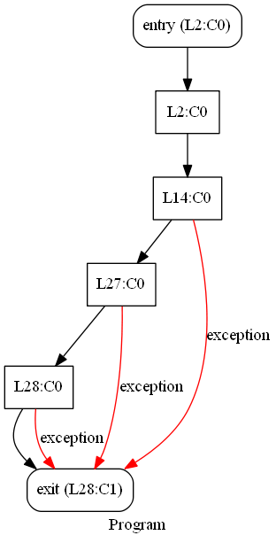
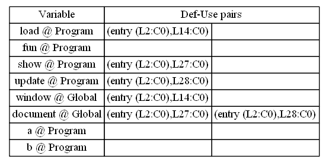
<hr>
####2.
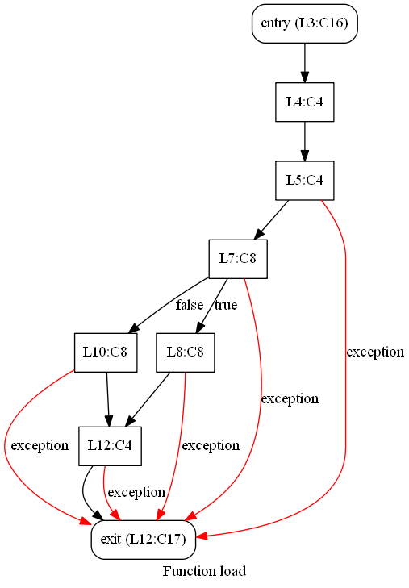
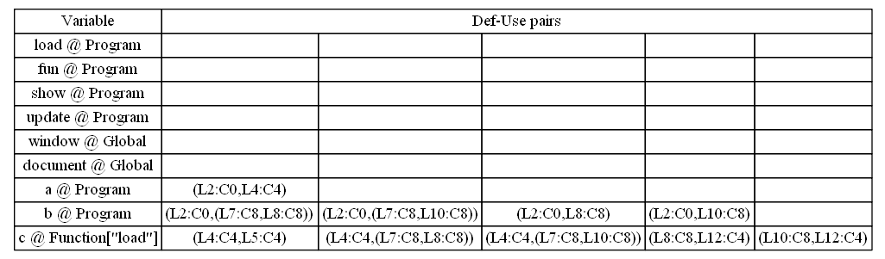
<hr>
####3.
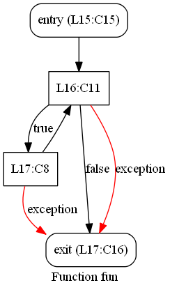
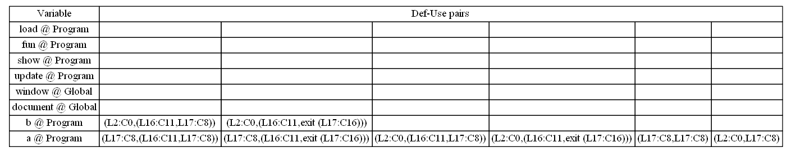
<hr>
####4.
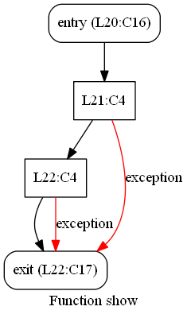
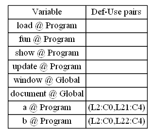
<hr>
####5.
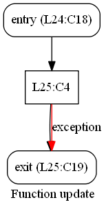
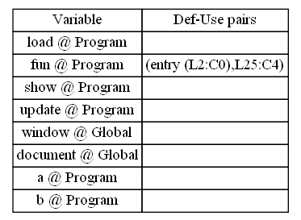
<hr>
###Inter-procedural dataflow graph
####1.
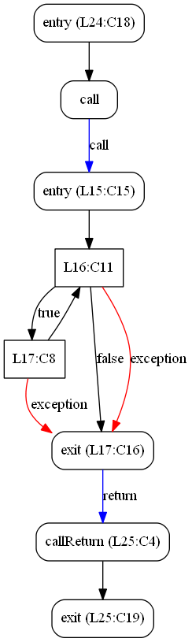
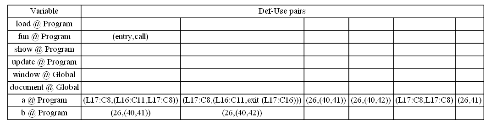
<hr>
###Intra-page dataflow graph
####1.
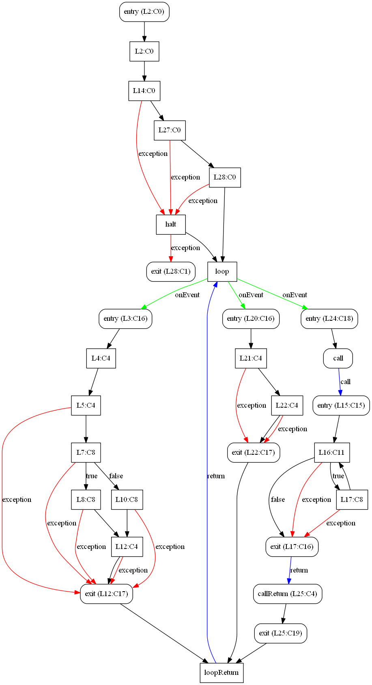
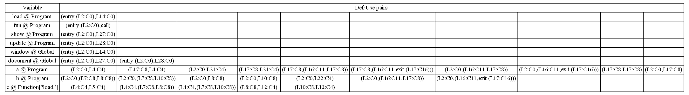