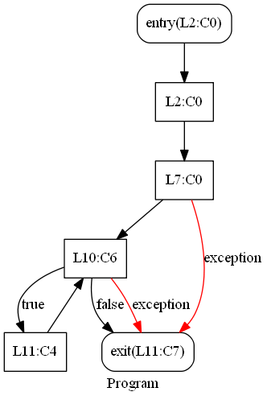
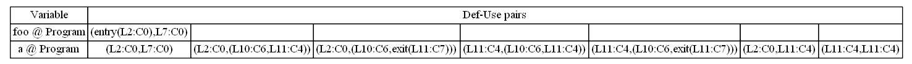
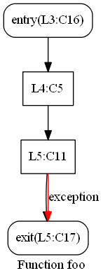
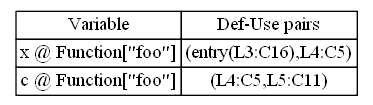
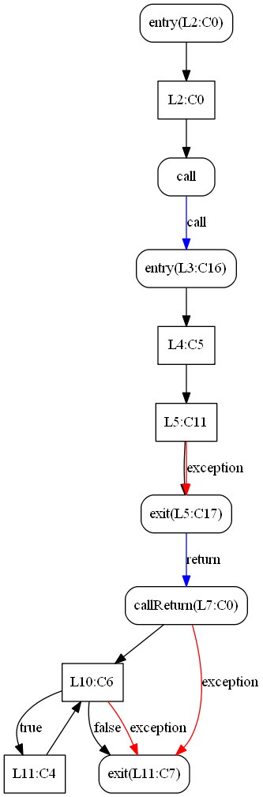
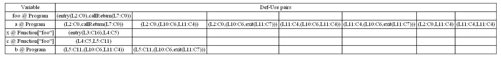

#dujs
##Def-Use tool for JavaScript
(working project)

Aim to find the intra-procedural, inter-procedural and intra-page Def-Use pairs of the client-side JavaScript.

##Dependency:
[analyses](https://github.com/Swatinem/analyses): Using the work list algorithm.<br>
[esgraph](https://github.com/Swatinem/esgraph): CFG builder<br>
[walkes](https://github.com/Swatinem/walkes): AST walker for [esprima](https://github.com/ariya/esprima) parsed tree<br>
[esprima](https://github.com/ariya/esprima): AST parser<br>
[Graphviz](http://www.graphviz.org): currently should be installed on local and add path to executable files in your system environment.

##Usage
```
node bin/dujs.js -js [src_file_1] [src_file_2] ... [src_file_i]
```

Result files will located under the <strong>out-[year]-[month]-[day]-[hour]-[minute]-[second]</strong> directory

##Limits
<ul>
    <li>Anonymous function call</li>
    <li>Closure</li>
    <li>HTML DOM object</li>
</ul>

##Sample
###Source
<pre>
/// --- start .1.js ---
var a = 1, b;
function foo(x) {
     var c = x;
           b = c;
}
foo(a - 1);
/// --- end .1.js ---
/// --- start .2.js ---
while(a > b) {
    a--;
}

/// --- end .2.js ---

</pre>

###Intra-procedural Analysis

<br>

<br>

<br>


###Inter-procedural Analysis

<br>

