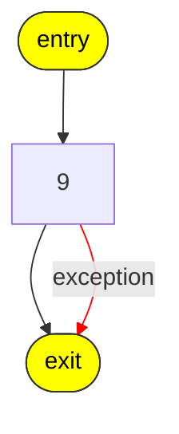

# `intra-procedural: $DOMAIN.$PAGE_0.$ANONYMOUS_FUN_0`

## Graph

```mermaid
flowchart TD
  n41(["entry"])
  n42["9"]
  n43(["exit"])
  n41 --> n42
  n42 --> n43
  n42 -->|"exception"| n43
  classDef ellipse fill:#ffff00,stroke:#333,color:#000
  class n41,n43 ellipse
  linkStyle 2 stroke:red
```

## Def-use pairs

| Variable | Def-Use pairs |
| --- | --- |
| `root` | `(entry,9)` |
