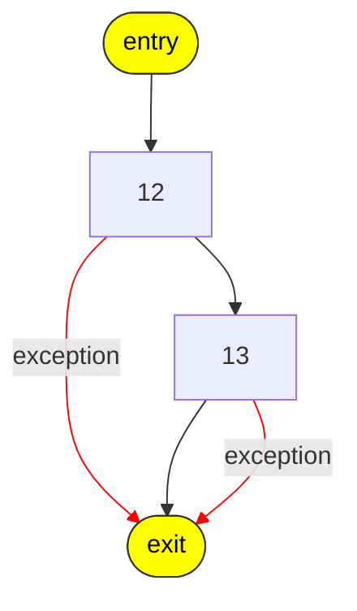

# `intra-procedural: $DOMAIN.$PAGE_0.$ANONYMOUS_FUN_1`

## Graph

```mermaid
flowchart TD
  n51(["entry"])
  n52["12"]
  n53["13"]
  n54(["exit"])
  n51 --> n52
  n52 --> n53
  n52 -->|"exception"| n54
  n53 --> n54
  n53 -->|"exception"| n54
  classDef ellipse fill:#ffff00,stroke:#333,color:#000
  class n51,n54 ellipse
  linkStyle 2,4 stroke:red
```

## Def-use pairs

| Variable | Def-Use pairs |
| --- | --- |
| `todos` | `(entry,12)` |
| `visible` | `(12,13)` |
