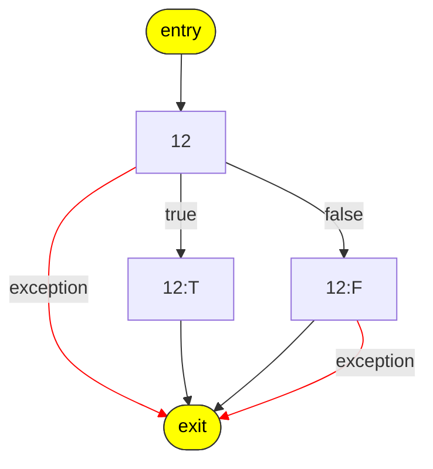

# `intra-procedural: $DOMAIN.$PAGE_0.$ANONYMOUS_FUN_1.$ANONYMOUS_FUN_2`

## Graph

```mermaid
flowchart TD
  n58(["entry"])
  n59["12"]
  n60["12#58;T"]
  n61["12#58;F"]
  n62(["exit"])
  n58 --> n59
  n59 -->|"true"| n60
  n59 -->|"false"| n61
  n59 -->|"exception"| n62
  n60 --> n62
  n61 --> n62
  n61 -->|"exception"| n62
  classDef ellipse fill:#ffff00,stroke:#333,color:#000
  class n58,n62 ellipse
  linkStyle 3,6 stroke:red
```

## Def-use pairs

| Variable | Def-Use pairs |
| --- | --- |
| `done` | `(entry,12:F)` |
