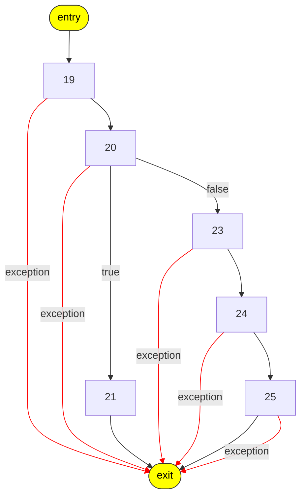

# `intra-procedural: $DOMAIN.$PAGE_0.$ANONYMOUS_FUN_3`

## Graph

```mermaid
flowchart TD
  n73(["entry"])
  n74["19"]
  n75["20"]
  n76["21"]
  n77["23"]
  n78["24"]
  n79["25"]
  n80(["exit"])
  n73 --> n74
  n74 --> n75
  n74 -->|"exception"| n80
  n75 -->|"true"| n76
  n75 -->|"false"| n77
  n75 -->|"exception"| n80
  n76 --> n80
  n77 --> n78
  n77 -->|"exception"| n80
  n78 --> n79
  n78 -->|"exception"| n80
  n79 --> n80
  n79 -->|"exception"| n80
  classDef ellipse fill:#ffff00,stroke:#333,color:#000
  class n73,n80 ellipse
  linkStyle 2,5,8,10,12 stroke:red
```

## Def-use pairs

| Variable | Def-Use pairs |
| --- | --- |
| `title` | `(19,(20,21))` `(19,(20,23))` `(19,23)` |
