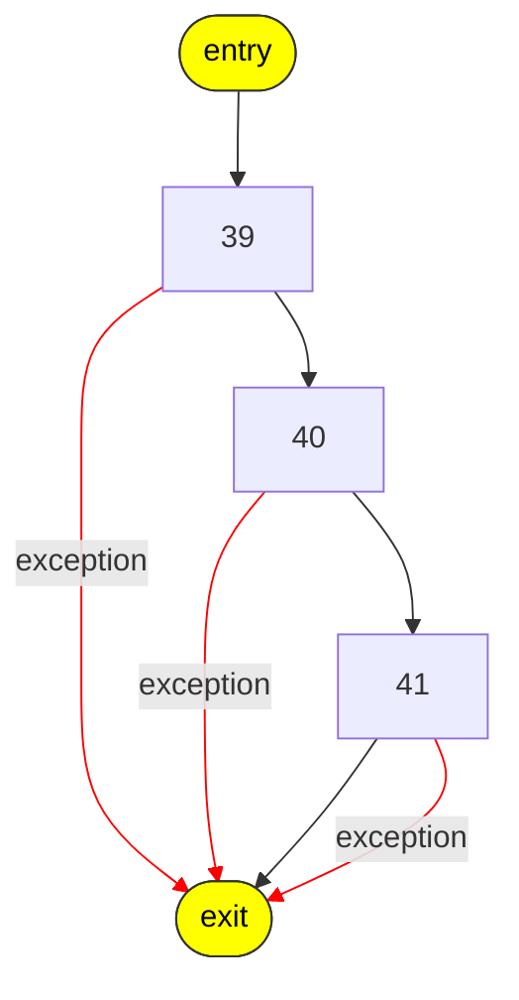

# `intra-procedural: $DOMAIN.$PAGE_0.$ANONYMOUS_FUN_4`

## Graph

```mermaid
flowchart TD
  n115(["entry"])
  n116["39"]
  n117["40"]
  n118["41"]
  n119(["exit"])
  n115 --> n116
  n116 --> n117
  n116 -->|"exception"| n119
  n117 --> n118
  n117 -->|"exception"| n119
  n118 --> n119
  n118 -->|"exception"| n119
  classDef ellipse fill:#ffff00,stroke:#333,color:#000
  class n115,n119 ellipse
  linkStyle 2,4,6 stroke:red
```

## Def-use pairs

| Variable | Def-Use pairs |
| --- | --- |
| `input` | `(39,40)` `(39,41)` |
