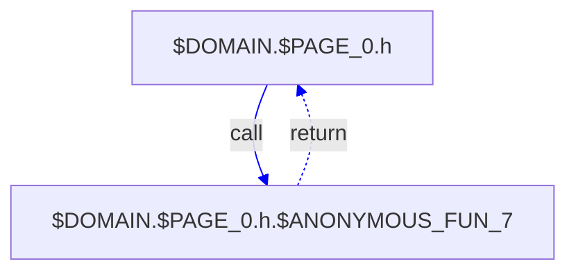
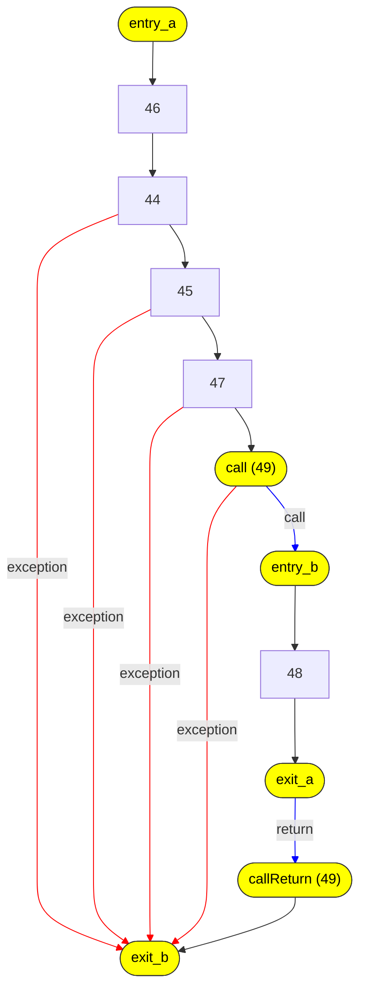

# `inter-procedural: $DOMAIN.$PAGE_0.h`

## Hierarchy

```mermaid
flowchart TD
  h0["$DOMAIN.$PAGE_0.h"]
  h1["$DOMAIN.$PAGE_0.h.$ANONYMOUS_FUN_7"]
  h0 -->|"call"| h1
  h1 -.->|"return"| h0
  linkStyle 0,1 stroke:blue
```

## Graph

```mermaid
flowchart TD
  n130(["entry_a"])
  n131["46"]
  n132["44"]
  n133["45"]
  n134["47"]
  n135(["call (49)"])
  n136(["entry_b"])
  n137["48"]
  n138(["exit_a"])
  n139(["callReturn (49)"])
  n140(["exit_b"])
  n130 --> n131
  n131 --> n132
  n132 --> n133
  n132 -->|"exception"| n140
  n133 --> n134
  n133 -->|"exception"| n140
  n134 --> n135
  n134 -->|"exception"| n140
  n135 -->|"exception"| n140
  n135 -->|"call"| n136
  n136 --> n137
  n137 --> n138
  n138 -->|"return"| n139
  n139 --> n140
  classDef ellipse fill:#ffff00,stroke:#333,color:#000
  class n130,n135,n136,n138,n139,n140 ellipse
  linkStyle 3,5,7,8 stroke:red
  linkStyle 9,12 stroke:blue
```

## Def-use pairs

| Variable | Def-Use pairs |
| --- | --- |
| `p` | `(44,45)` |
| `q` | `(45,48)` |
| `g` | `(47,call (49))` |
