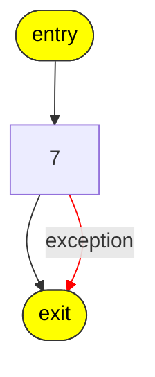

# `intra-procedural: $DOMAIN.$PAGE_0.P`

## Graph

```mermaid
flowchart TD
  n57(["entry"])
  n58["7"]
  n59(["exit"])
  n57 --> n58
  n58 --> n59
  n58 -->|"exception"| n59
  classDef ellipse fill:#ffff00,stroke:#333,color:#000
  class n57,n59 ellipse
  linkStyle 2 stroke:red
```

## Def-use pairs

| Variable | Def-Use pairs |
| --- | --- |
| `v` | `(entry,7)` |
| `x` |  |
