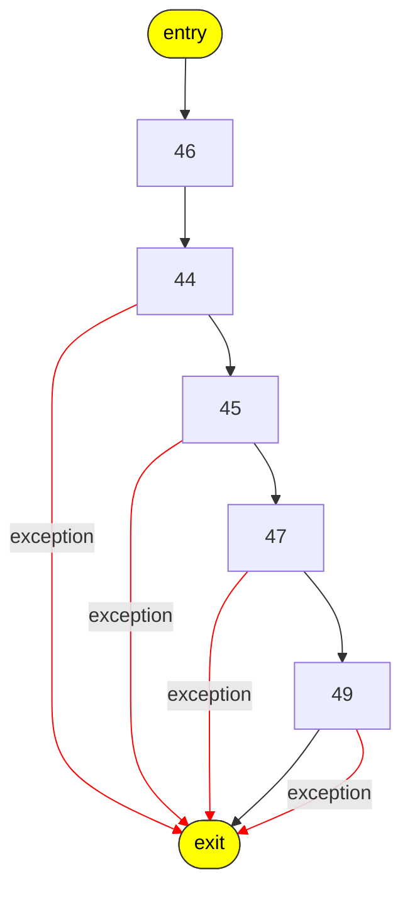

# `intra-procedural: $DOMAIN.$PAGE_0.h`

## Graph

```mermaid
flowchart TD
  n130(["entry"])
  n131["46"]
  n132["44"]
  n133["45"]
  n134["47"]
  n135["49"]
  n136(["exit"])
  n130 --> n131
  n131 --> n132
  n132 --> n133
  n132 -->|"exception"| n136
  n133 --> n134
  n133 -->|"exception"| n136
  n134 --> n135
  n134 -->|"exception"| n136
  n135 --> n136
  n135 -->|"exception"| n136
  classDef ellipse fill:#ffff00,stroke:#333,color:#000
  class n130,n136 ellipse
  linkStyle 3,5,7,9 stroke:red
```

## Def-use pairs

| Variable | Def-Use pairs |
| --- | --- |
| `p` | `(44,45)` |
| `q` |  |
| `g` | `(47,49)` |
