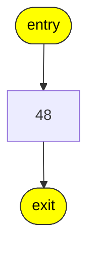

# `intra-procedural: $DOMAIN.$PAGE_0.h.$ANONYMOUS_FUN_7`

## Graph

```mermaid
flowchart TD
  n140(["entry"])
  n141["48"]
  n142(["exit"])
  n140 --> n141
  n141 --> n142
  classDef ellipse fill:#ffff00,stroke:#333,color:#000
  class n140,n142 ellipse
```

## Def-use pairs

| Variable | Def-Use pairs |
| --- | --- |
