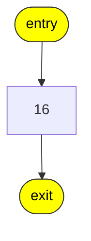

# `intra-procedural: $DOMAIN.$PAGE_0.$ANONYMOUS_FUN_2`

## Graph

```mermaid
flowchart TD
  n77(["entry"])
  n78["16"]
  n79(["exit"])
  n77 --> n78
  n78 --> n79
  classDef ellipse fill:#ffff00,stroke:#333,color:#000
  class n77,n79 ellipse
```

## Def-use pairs

| Variable | Def-Use pairs |
| --- | --- |
