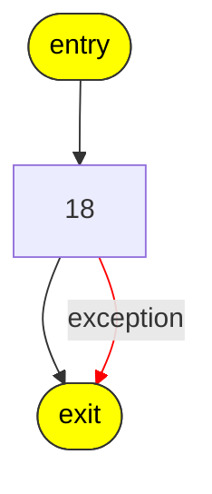

# `intra-procedural: $DOMAIN.$PAGE_0.$ANONYMOUS_FUN_3`

## Graph

```mermaid
flowchart TD
  n83(["entry"])
  n84["18"]
  n85(["exit"])
  n83 --> n84
  n84 --> n85
  n84 -->|"exception"| n85
  classDef ellipse fill:#ffff00,stroke:#333,color:#000
  class n83,n85 ellipse
  linkStyle 2 stroke:red
```

## Def-use pairs

| Variable | Def-Use pairs |
| --- | --- |
| `x` |  |
