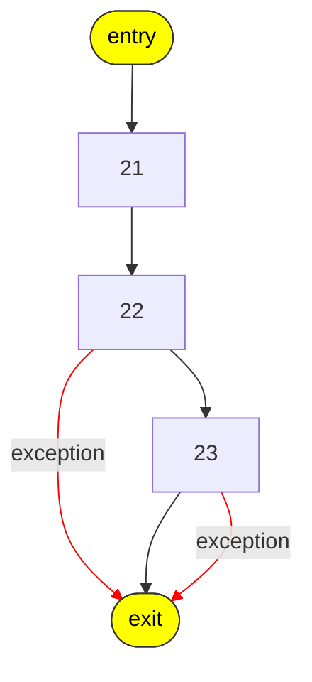

# `intra-procedural: $DOMAIN.$PAGE_0.$ANONYMOUS_FUN_4`

## Graph

```mermaid
flowchart TD
  n94(["entry"])
  n95["21"]
  n96["22"]
  n97["23"]
  n98(["exit"])
  n94 --> n95
  n95 --> n96
  n96 --> n97
  n96 -->|"exception"| n98
  n97 --> n98
  n97 -->|"exception"| n98
  classDef ellipse fill:#ffff00,stroke:#333,color:#000
  class n94,n98 ellipse
  linkStyle 3,5 stroke:red
```

## Def-use pairs

| Variable | Def-Use pairs |
| --- | --- |
| `n` | `(entry,21)` |
| `t` | `(21,23)` |
| `y` |  |
