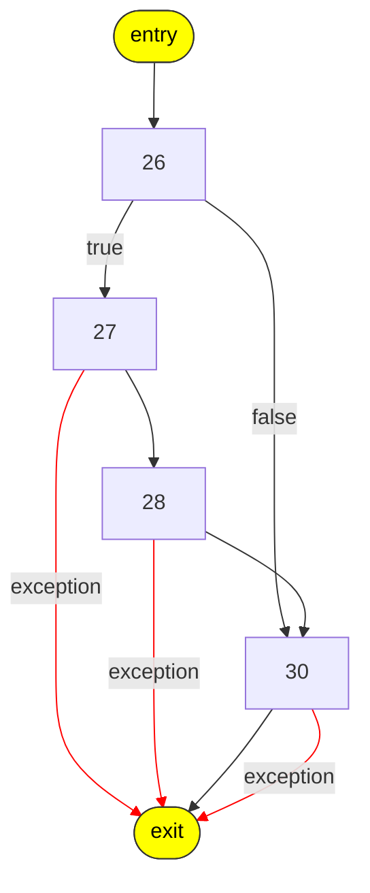

# `intra-procedural: $DOMAIN.$PAGE_0.$ANONYMOUS_FUN_5`

## Graph

```mermaid
flowchart TD
  n107(["entry"])
  n108["26"]
  n109["27"]
  n110["28"]
  n111(["exit"])
  n112["30"]
  n107 --> n108
  n108 -->|"true"| n109
  n108 -->|"false"| n112
  n109 --> n110
  n109 -->|"exception"| n111
  n110 --> n112
  n110 -->|"exception"| n111
  n112 --> n111
  n112 -->|"exception"| n111
  classDef ellipse fill:#ffff00,stroke:#333,color:#000
  class n107,n111 ellipse
  linkStyle 4,6,8 stroke:red
```

## Def-use pairs

| Variable | Def-Use pairs |
| --- | --- |
| `c` |  |
| `x` |  |
