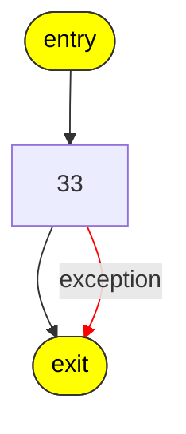

# `intra-procedural: $DOMAIN.$PAGE_0.$ANONYMOUS_FUN_6`

## Graph

```mermaid
flowchart TD
  n116(["entry"])
  n117["33"]
  n118(["exit"])
  n116 --> n117
  n117 --> n118
  n117 -->|"exception"| n118
  classDef ellipse fill:#ffff00,stroke:#333,color:#000
  class n116,n118 ellipse
  linkStyle 2 stroke:red
```

## Def-use pairs

| Variable | Def-Use pairs |
| --- | --- |
| `x` |  |
