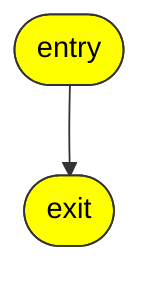

# `intra-procedural: $DOMAIN.$PAGE_0.log`

## Graph

```mermaid
flowchart TD
  n121(["entry"])
  n122(["exit"])
  n121 --> n122
  classDef ellipse fill:#ffff00,stroke:#333,color:#000
  class n121,n122 ellipse
```

## Def-use pairs

| Variable | Def-Use pairs |
| --- | --- |
| `value` |  |
