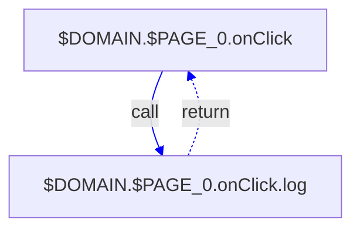
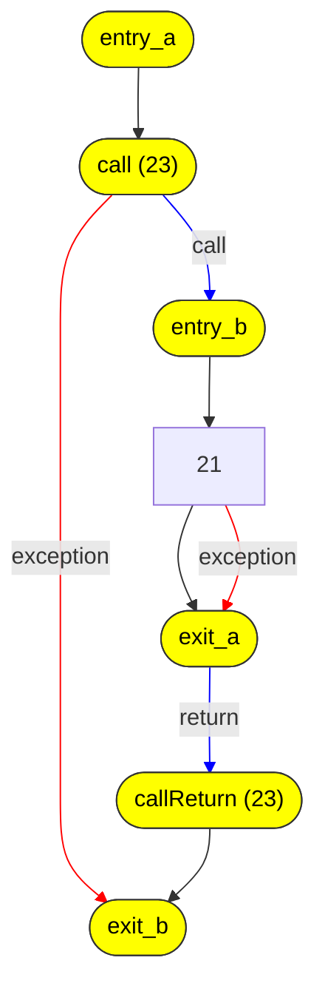

# `inter-procedural: $DOMAIN.$PAGE_0.onClick`

## Hierarchy

```mermaid
flowchart TD
  h0["$DOMAIN.$PAGE_0.onClick"]
  h1["$DOMAIN.$PAGE_0.onClick.log"]
  h0 -->|"call"| h1
  h1 -.->|"return"| h0
  linkStyle 0,1 stroke:blue
```

## Graph

```mermaid
flowchart TD
  n62(["entry_a"])
  n63(["call (23)"])
  n64(["entry_b"])
  n65["21"]
  n66(["exit_a"])
  n67(["callReturn (23)"])
  n68(["exit_b"])
  n62 --> n63
  n63 -->|"exception"| n68
  n63 -->|"call"| n64
  n64 --> n65
  n65 --> n66
  n65 -->|"exception"| n66
  n66 -->|"return"| n67
  n67 --> n68
  classDef ellipse fill:#ffff00,stroke:#333,color:#000
  class n62,n63,n64,n66,n67,n68 ellipse
  linkStyle 1,5 stroke:red
  linkStyle 2,6 stroke:blue
```

## Def-use pairs

| Variable | Def-Use pairs |
| --- | --- |
| `log` | `(entry_a,call (23))` |
