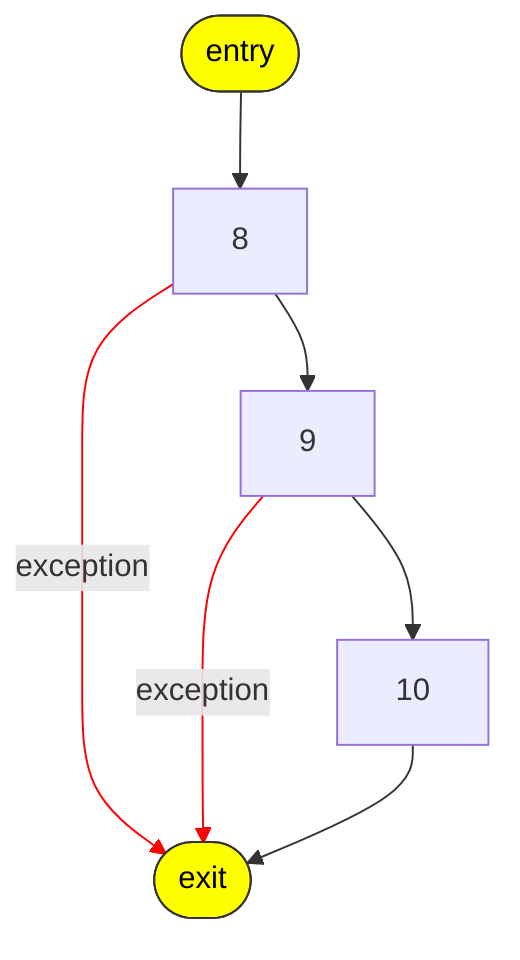

# `intra-procedural: $DOMAIN.$PAGE_0.addTo`

## Graph

```mermaid
flowchart TD
  n39(["entry"])
  n40["8"]
  n41["9"]
  n42["10"]
  n43(["exit"])
  n39 --> n40
  n40 --> n41
  n40 -->|"exception"| n43
  n41 --> n42
  n41 -->|"exception"| n43
  n42 --> n43
  classDef ellipse fill:#ffff00,stroke:#333,color:#000
  class n39,n43 ellipse
  linkStyle 2,4 stroke:red
```

## Def-use pairs

| Variable | Def-Use pairs |
| --- | --- |
| `value` | `(entry,8)` |
| `scale` | `(entry,9)` |
| `total` | `(8,10)` |
