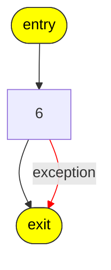

# `intra-procedural: $DOMAIN.$PAGE_0.addTo.scale`

## Graph

```mermaid
flowchart TD
  n48(["entry"])
  n49["6"]
  n50(["exit"])
  n48 --> n49
  n49 --> n50
  n49 -->|"exception"| n50
  classDef ellipse fill:#ffff00,stroke:#333,color:#000
  class n48,n50 ellipse
  linkStyle 2 stroke:red
```

## Def-use pairs

| Variable | Def-Use pairs |
| --- | --- |
