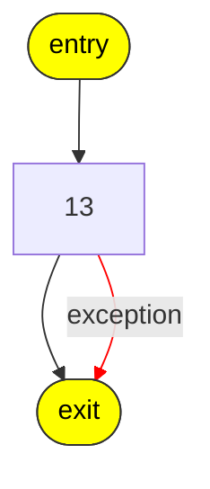

# `intra-procedural: $DOMAIN.$PAGE_0.isReady`

## Graph

```mermaid
flowchart TD
  n55(["entry"])
  n56["13"]
  n57(["exit"])
  n55 --> n56
  n56 --> n57
  n56 -->|"exception"| n57
  classDef ellipse fill:#ffff00,stroke:#333,color:#000
  class n55,n57 ellipse
  linkStyle 2 stroke:red
```

## Def-use pairs

| Variable | Def-Use pairs |
| --- | --- |
