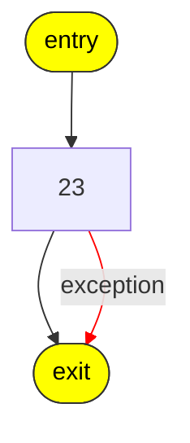

# `intra-procedural: $DOMAIN.$PAGE_0.onClick`

## Graph

```mermaid
flowchart TD
  n62(["entry"])
  n63["23"]
  n64(["exit"])
  n62 --> n63
  n63 --> n64
  n63 -->|"exception"| n64
  classDef ellipse fill:#ffff00,stroke:#333,color:#000
  class n62,n64 ellipse
  linkStyle 2 stroke:red
```

## Def-use pairs

| Variable | Def-Use pairs |
| --- | --- |
| `log` | `(entry,23)` |
