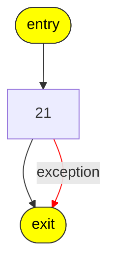

# `intra-procedural: $DOMAIN.$PAGE_0.onClick.log`

## Graph

```mermaid
flowchart TD
  n68(["entry"])
  n69["21"]
  n70(["exit"])
  n68 --> n69
  n69 --> n70
  n69 -->|"exception"| n70
  classDef ellipse fill:#ffff00,stroke:#333,color:#000
  class n68,n70 ellipse
  linkStyle 2 stroke:red
```

## Def-use pairs

| Variable | Def-Use pairs |
| --- | --- |
