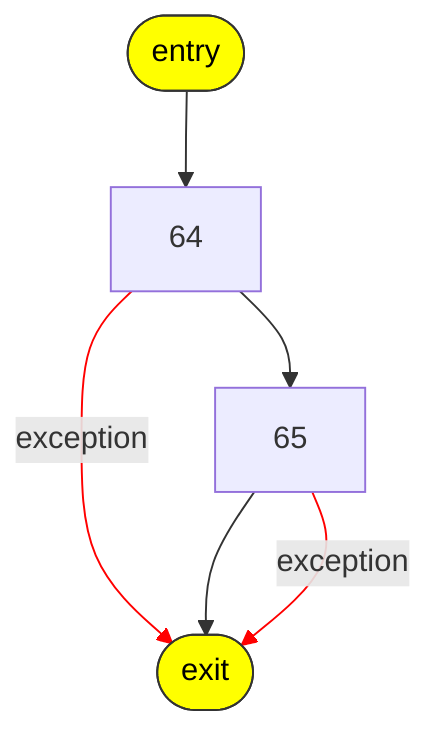

# `intra-procedural: $DOMAIN.$PAGE_0.onLoad`

## Graph

```mermaid
flowchart TD
  n164(["entry"])
  n165["64"]
  n166["65"]
  n167(["exit"])
  n164 --> n165
  n165 --> n166
  n165 -->|"exception"| n167
  n166 --> n167
  n166 -->|"exception"| n167
  classDef ellipse fill:#ffff00,stroke:#333,color:#000
  class n164,n167 ellipse
  linkStyle 2,4 stroke:red
```

## Def-use pairs

| Variable | Def-Use pairs |
| --- | --- |
| `items` | `(64,65)` |
| `total` |  |
