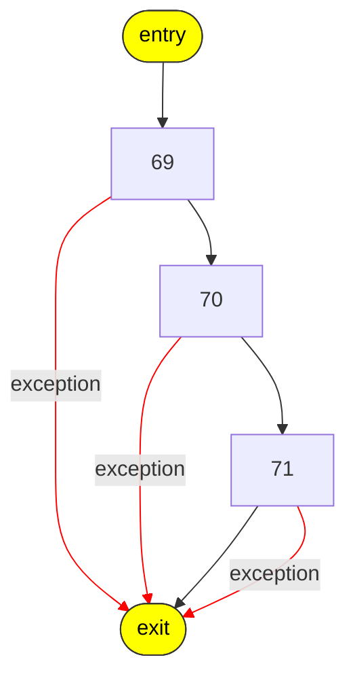

# `intra-procedural: $DOMAIN.$PAGE_0.onAdd`

## Graph

```mermaid
flowchart TD
  n173(["entry"])
  n174["69"]
  n175["70"]
  n176["71"]
  n177(["exit"])
  n173 --> n174
  n174 --> n175
  n174 -->|"exception"| n177
  n175 --> n176
  n175 -->|"exception"| n177
  n176 --> n177
  n176 -->|"exception"| n177
  classDef ellipse fill:#ffff00,stroke:#333,color:#000
  class n173,n177 ellipse
  linkStyle 2,4,6 stroke:red
```

## Def-use pairs

| Variable | Def-Use pairs |
| --- | --- |
| `total` |  |
