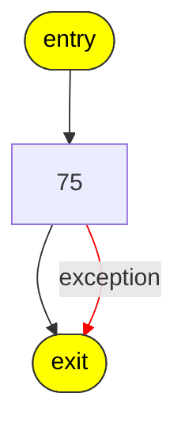

# `intra-procedural: $DOMAIN.$PAGE_0.onModeChange`

## Graph

```mermaid
flowchart TD
  n181(["entry"])
  n182["75"]
  n183(["exit"])
  n181 --> n182
  n182 --> n183
  n182 -->|"exception"| n183
  classDef ellipse fill:#ffff00,stroke:#333,color:#000
  class n181,n183 ellipse
  linkStyle 2 stroke:red
```

## Def-use pairs

| Variable | Def-Use pairs |
| --- | --- |
| `mode` |  |
