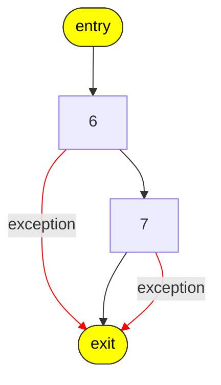

# `intra-procedural: $DOMAIN.$PAGE_1.onLoad`

## Graph

```mermaid
flowchart TD
  n208(["entry"])
  n209["6"]
  n210["7"]
  n211(["exit"])
  n208 --> n209
  n209 --> n210
  n209 -->|"exception"| n211
  n210 --> n211
  n210 -->|"exception"| n211
  classDef ellipse fill:#ffff00,stroke:#333,color:#000
  class n208,n211 ellipse
  linkStyle 2,4 stroke:red
```

## Def-use pairs

| Variable | Def-Use pairs |
| --- | --- |
| `saved` | `(6,7)` |
| `count` |  |
