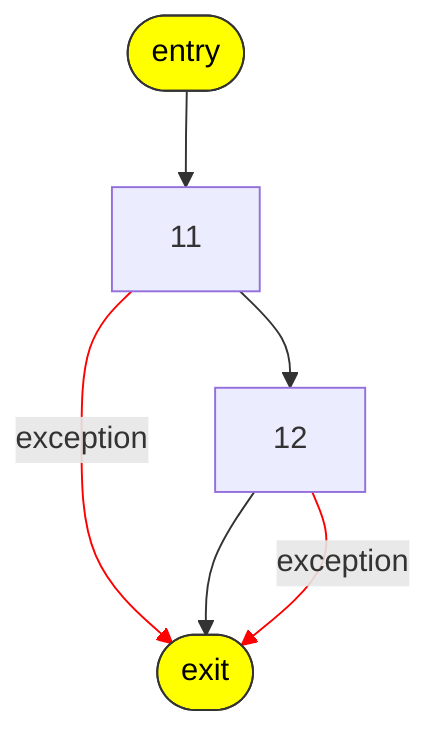

# `intra-procedural: $DOMAIN.$PAGE_1.onClear`

## Graph

```mermaid
flowchart TD
  n216(["entry"])
  n217["11"]
  n218["12"]
  n219(["exit"])
  n216 --> n217
  n217 --> n218
  n217 -->|"exception"| n219
  n218 --> n219
  n218 -->|"exception"| n219
  classDef ellipse fill:#ffff00,stroke:#333,color:#000
  class n216,n219 ellipse
  linkStyle 2,4 stroke:red
```

## Def-use pairs

| Variable | Def-Use pairs |
| --- | --- |
| `count` |  |
